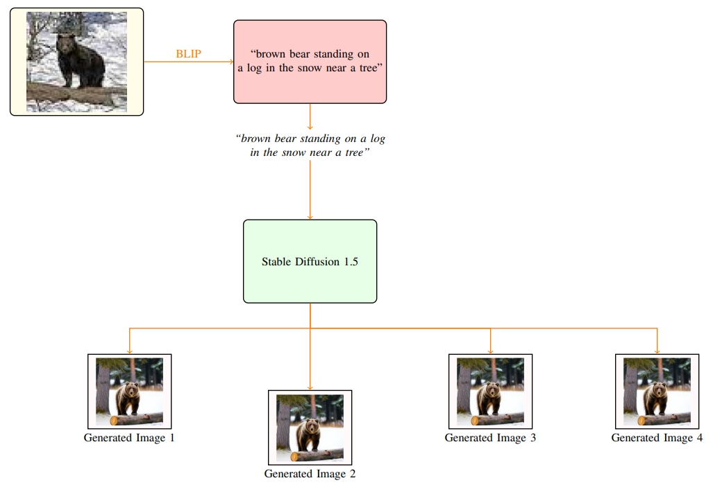

# Data Augmentation Using Image Generation

## Repository Contents

1. **Colab Notebook**  
   
   
2. **Report**  
   [Download Report](https://drive.google.com/file/d/132escLz_4e7LtyQ1XTn06M7V8itDYumT/view?usp=sharing)

3. **Unbalanced Dataset**  
   [Download Unbalanced Dataset](https://drive.google.com/file/d/1tvw_OuokEJ5XGEWY5QWjOP-fwm3MHFtI/view?usp=drive_link)

4. **Balanced Dataset**  
   [Download Balanced Dataset](https://drive.google.com/file/d/17AtQqRNWY3O300ZiGTV0-b_hgqj9M8Z8/view?usp=drive_link)

## Figures

### Our Method

### Experimental Results

